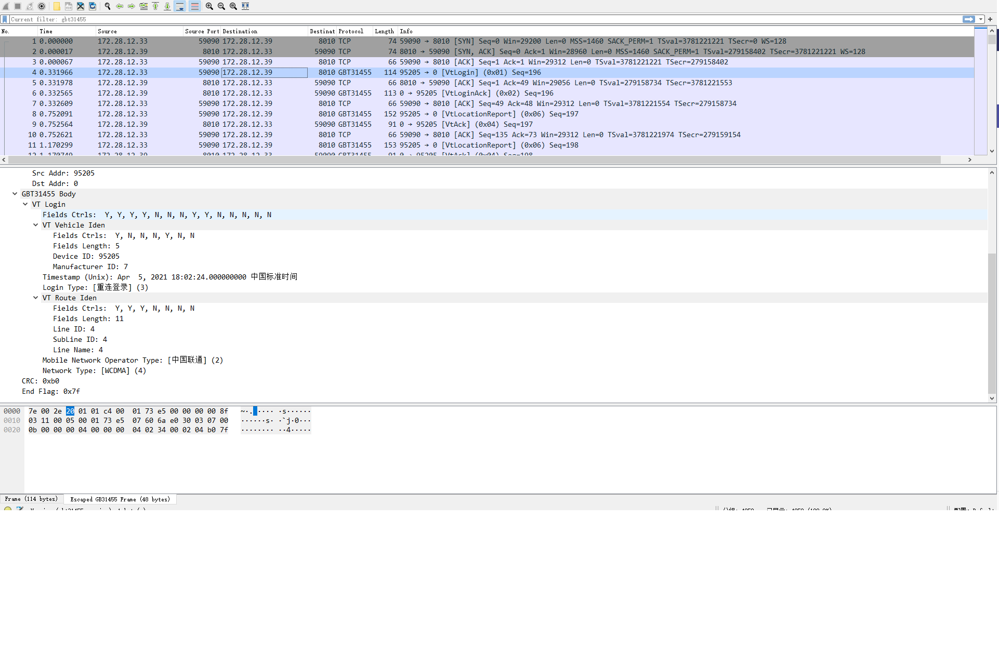

JT808_GBT31455-wireshark-dissector
========================

Wireshark dissector for JT808 and GBT31455.2 protocol.

Detail information for JT808 can be found here http://www.mot.gov.cn/yijianzhengji/201706/P020170629514064508301.pdf

Detail information for JT808 can be found here http://openstd.samr.gov.cn/bzgk/gb/newGbInfo?hcno=70A0A99C98706281319DD0DAD301B418

## Install

- Find the `wireshark plugin dir` by look into Wireshark's Help->About->Directory->Personal Plugin directory.
- Copy `*.lua` to `wireshark plugin dir` (If you are on Windows, you can just choose  `%APPDATA%\Wireshark\plugins`)
- Add your local ports to `You can add other tcp port` comment in any of jt808.lua or gbt31455.lua.
- Start Wireshark

### Required Wireshark Version

Version 1.11.3 or higher

## Screenshot

## Contributions

This is only a very basic implementation.

Contributions are welcome!
